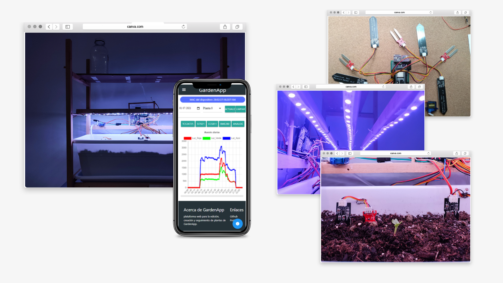

Este proyecto consiste en el diseño de una alternativa a los sistemas comerciales de huerto inteligente, teniendo en cuenta la escalabilidad, la personalización y el respeto con el medio ambiente.

## Resumen

La metodología utilizada para este proyecto es DIY (Do It Yourself) o también
conocido como hazlo tú mismo en español, busca crear productos personalizados,
económicos y reparables. Esta metodología promueve el hardware y software libre al
abordar el diseño del producto, por esta razón el sistema fue diseñado para ser modular
tanto en software como en hardware, permitiendo adaptar el software a las limitaciones
del hardware seleccionado.

El microcontrolador utilizado para este proyecto es la placa de desarrollo ESP32-
DevKitC-32D de Espressif permitiendo al usuario el cuidado de un máximo de cuatro
plantas. Además, proporciona información del estado actual del huerto, suministro de
iluminación personalizado y riego automático por planta.

El sistema desarrollado cuenta con tres subsistemas: el huerto, el servidor central
y la plataforma web. El huerto es quien se encarga físicamente del cuidado de las plantas
y obtiene información individual de cada una de ellas. Dicha información es tratada por
el servidor central que se encarga de procesar, estructurar y almacenar la información
para que esté a disposición de la plataforma web, que es la interfaz gráfica del sistema.

La comunicación del usuario con el huerto se realiza a través de la plataforma web
y se accede desde cualquier móvil con navegador web. El usuario es capaz de agregar,
editar y eliminar plantas del huerto. Además, permite de manera interactiva monitorizar
las variables físicas del huerto y entender de forma cuantitativa el estado del huerto.

Una vez desarrollado todo el sistema, se procedió a analizar los resultados
obtenidos del prototipo durante cinco meses y se concluye que cumple con las
especificaciones descritas, ya que el huerto es capaz de obtener los datos del entorno,
suministrar iluminación y regar con la frecuencia fijada por el usuario. Además,
proporciona al usuario una mayor información sobre el estado general e individual de las
plantas, ya que ofrece históricos de los datos recopilados del huerto que ayudan de manera
gráfica e intuitiva a entender el entorno en el que se encuentra y cómo puede el usuario
mejorar el cuidado de las plantas.



